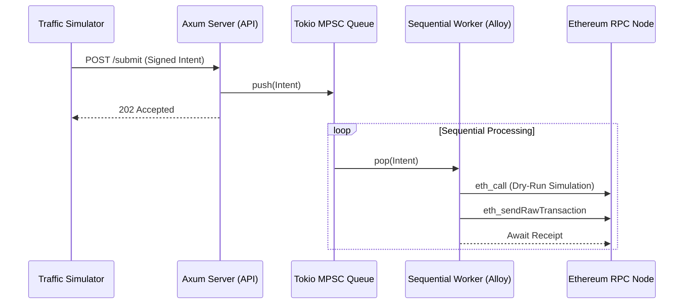

# Gas Relayer Service: Architecture & Implementation

## 1. Project Directory Structure
```text
traffic_simulator/
├── Cargo.toml           # Dependencies: axum, tokio, alloy, serde
├── src/
│   ├── main.rs          # Relayer API & Sequential Worker
│   └── bin/
│       └── simulator.rs # Traffic Simulator Script
├── .env                 # PRIVATE_KEY (Relayer Wallet) - gitignored, never committed
└── .env.example         # Template: copy to .env and fill in your key
```

## 2. Running the Demo (local Anvil chain)

```bash
# Terminal 1 - start a local chain
anvil

# Terminal 2 - load the relayer key into the shell.
# NOTE: there is no dotenvy in this project, so `.env` is NOT read for you:
# the process needs a real environment variable.
set -a; source .env; set +a      # or: export PRIVATE_KEY=0x...
# Optional overrides:
# export RPC_URL=http://127.0.0.1:8545
# export FORWARDER_ADDRESS=0x<deployed EIP-2771 forwarder>

cargo run                        # relayer API on 127.0.0.1:3000

# Terminal 3 - bombard the relayer with 50 concurrent intents
cargo run --bin simulator

# Terminal 4 - verify what actually landed on chain
cast block-number
cast tx <hash printed by the relayer>
```

`FORWARDER_ADDRESS` defaults to `0x0000...0000`. Sending calldata to an empty account is a
*successful* no-op on Anvil, so the whole pipeline is demonstrable before you deploy a real
EIP-2771 forwarder.

## 3. Architecture Diagram


---

## 4. Full Source Code (src/main.rs)
This code acts as both the REST API and the sequential executor.

```rust
use axum::{Json, Router, extract::State, routing::post};
use serde::Deserialize;
use std::sync::Arc;
use tokio::sync::mpsc;
// Note: Ensure alloy is configured in Cargo.toml
use alloy::network::{EthereumWallet, TransactionBuilder};
use alloy::primitives::{Address, Bytes};
use alloy::providers::{Provider, ProviderBuilder};
use alloy::rpc::types::TransactionRequest;
use alloy::signers::local::PrivateKeySigner;

// 1. Define Request Payload
#[derive(Deserialize, Clone)]
struct MetaTxRequest {
    user: String,
    data: String,
    signature: String,
}

// 2. Application State
struct AppState {
    tx_sender: mpsc::Sender<MetaTxRequest>,
}

#[tokio::main]
async fn main() -> Result<(), Box<dyn std::error::Error>> {
    // 3. Setup MPSC Channel (Buffer of 100)
    let (tx_sender, mut tx_receiver) = mpsc::channel::<MetaTxRequest>(100);

    // 4. Relayer wallet + provider.
    //    Built *before* spawning the worker so that a bad key / unreachable RPC fails
    //    loudly at startup instead of silently killing the background task.
    let signer: PrivateKeySigner = std::env::var("PRIVATE_KEY")
        .expect("PRIVATE_KEY not set")
        .parse()?;
    let wallet = EthereumWallet::from(signer);

    let rpc_url = std::env::var("RPC_URL").unwrap_or_else(|_| "http://127.0.0.1:8545".to_string());
    let provider = ProviderBuilder::new().wallet(wallet).connect(&rpc_url).await?;

    // EIP-2771 trusted forwarder that every intent is relayed to.
    // TODO: point this at your deployed forwarder, or export FORWARDER_ADDRESS.
    let forwarder: Address = std::env::var("FORWARDER_ADDRESS")
        .unwrap_or_else(|_| Address::ZERO.to_string())
        .parse()?;

    // 5. Background Sequential Worker (The Heart of the Relayer)
    tokio::spawn(async move {
        // Process intents sequentially: one transaction at a time, in arrival order.
        while let Some(req) = tx_receiver.recv().await {
            // NOTE: `signature` is only logged -- it is never verified. A real relayer MUST
            // recover the signer from it and reject intents that do not match `req.user`.
            println!("Processing intent for: {} (sig: {})", req.user, req.signature);

            // Translate the off-chain intent into an on-chain call:
            // to = trusted forwarder, input = the intent's calldata.
            let call = TransactionRequest::default()
                .with_to(forwarder)
                .with_input(Bytes::from(alloy::hex::decode(&req.data).unwrap_or_default()));

            // Simulation Step (Dry-run)
            // if !dry_run(&provider, &call).await { continue; }

            // Dispatch Transaction
            match provider.send_transaction(call).await {
                Ok(tx) => println!("Dispatched: {:?}", tx.tx_hash()),
                Err(e) => eprintln!("Execution Error: {}", e),
            }
        }
    });

    // 6. REST API Layer
    let state = Arc::new(AppState { tx_sender });
    let app = Router::new()
        .route("/submit", post(submit_handler))
        .with_state(state);

    let listener = tokio::net::TcpListener::bind("127.0.0.1:3000").await?;
    println!("🚀 Relayer API listening on port 3000");
    axum::serve(listener, app).await?;

    Ok(())
}

async fn submit_handler(
    State(state): State<Arc<AppState>>,
    Json(payload): Json<MetaTxRequest>,
) -> &'static str {
    // Non-blocking handoff to queue
    let _ = state.tx_sender.send(payload).await;
    "Transaction Queued"
}
```

## 5. Full Source Code (src/bin/simulator.rs)
This simulates high-concurrency traffic.

```rust
use reqwest::Client;
use std::sync::Arc;
use tokio::task;

#[tokio::main]
async fn main() {
    let client = Arc::new(Client::new());
    let url = "http://127.0.0.1:3000/submit";
    let mut handles = Vec::new();

    for i in 0..50 {
        let client_ref = Arc::clone(&client);
        let url_ref = url.to_string();

        handles.push(task::spawn(async move {
            let payload = serde_json::json!({
                "user": format!("user_{}", i),
                "data": "0xdeadbeef",
                "signature": "0xcafe"
            });
            let _ = client_ref.post(url_ref).json(&payload).send().await;
        }));
    }

    for h in handles {
        let _ = h.await;
    }
    println!("Finished bombarding the Relayer.");
}
```

---

## 6. Deliberately left unfixed (your exercises)

1. **`signature` is never verified.** The relayer relays any payload it is handed. Recover the
   signer from `signature` and reject intents whose recovered address does not match `user`.
2. **`dotenvy` is not a dependency**, so `.env` is not read automatically -- the shell must
   export `PRIVATE_KEY`. Make `.env` load automatically.
3. **The dry-run step is still a comment.** Implement the `eth_call` simulation
   (`provider.call(&call)`) and skip intents that would revert.
4. **Throughput is one transaction at a time.** Deliberately sequential, to keep nonces sane.
   Make it concurrent without breaking nonce ordering, then measure the difference.
5. **`FORWARDER_ADDRESS` defaults to `0x0000...0000`.** Deploy a real EIP-2771 trusted
   forwarder and relay through it.

