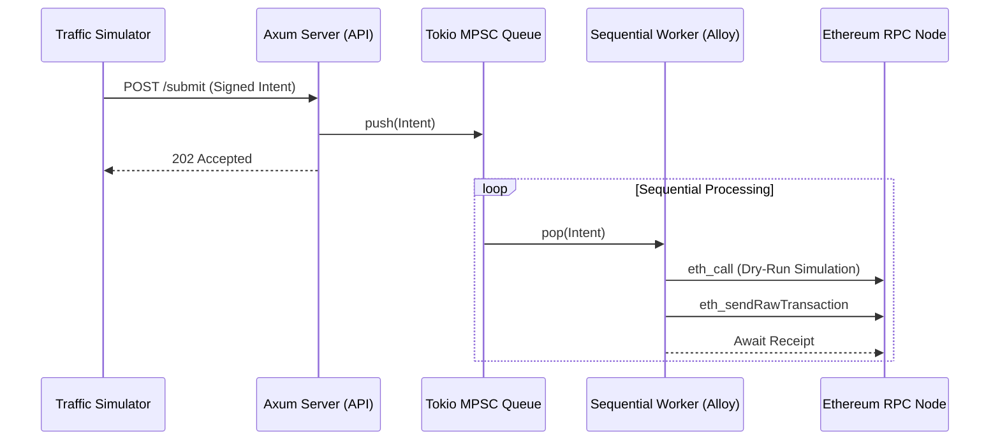

# Gas Relayer Service: Architecture & Implementation

## 1. Project Directory Structure
```text
traffic_simulator/
├── Cargo.toml           # Dependencies: axum, tokio, alloy, serde
├── src/
│   ├── main.rs          # Relayer API & Sequential Worker
│   └── bin/
│       └── simulator.rs # Traffic Simulator Script
├── .env                 # PRIVATE_KEY (Relayer Wallet) - gitignored, never committed
└── .env.example         # Template: copy to .env and fill in your key
```

## 2. Running the Demo (local Anvil chain)

```bash
# Terminal 1 - start a local chain
anvil

# Terminal 2 - start the relayer. It loads `.env` itself (src/config.rs, no `dotenvy`
# dependency), so there is nothing to `source` as long as you start it from the repo root.
cargo run                        # relayer API on 127.0.0.1:3000

# Real environment variables always beat `.env`, so overrides look like this:
# RPC_URL=http://127.0.0.1:8545 FORWARDER_ADDRESS=0x<deployed EIP-2771 forwarder> cargo run

# Terminal 3 - honest traffic (50 concurrent intents)
cargo run --bin simulator -- honest 50

# Terminal 4 - verify what actually landed on chain
cast block-number
cast tx <hash printed by the relayer>
```

`FORWARDER_ADDRESS` defaults to `0x0000...0000`. Sending calldata to an empty account is a
*successful* no-op on Anvil, so the whole pipeline is demonstrable before you deploy a real
EIP-2771 forwarder.

## 3. Architecture Diagram


---

## 4. Full Source Code (src/main.rs)
This code acts as both the REST API and the sequential executor.

```rust
use axum::{Json, Router, extract::State, routing::post};
use serde::Deserialize;
use std::sync::Arc;
use tokio::sync::mpsc;
// Note: Ensure alloy is configured in Cargo.toml
use alloy::network::{EthereumWallet, TransactionBuilder};
use alloy::primitives::{Address, Bytes};
use alloy::providers::{Provider, ProviderBuilder};
use alloy::rpc::types::TransactionRequest;
use alloy::signers::local::PrivateKeySigner;

// 1. Define Request Payload
#[derive(Deserialize, Clone)]
struct MetaTxRequest {
    user: String,
    data: String,
    signature: String,
}

// 2. Application State
struct AppState {
    tx_sender: mpsc::Sender<MetaTxRequest>,
}

#[tokio::main]
async fn main() -> Result<(), Box<dyn std::error::Error>> {
    // 3. Setup MPSC Channel (Buffer of 100)
    let (tx_sender, mut tx_receiver) = mpsc::channel::<MetaTxRequest>(100);

    // 4. Relayer wallet + provider.
    //    Built *before* spawning the worker so that a bad key / unreachable RPC fails
    //    loudly at startup instead of silently killing the background task.
    let signer: PrivateKeySigner = std::env::var("PRIVATE_KEY")
        .expect("PRIVATE_KEY not set")
        .parse()?;
    let wallet = EthereumWallet::from(signer);

    let rpc_url = std::env::var("RPC_URL").unwrap_or_else(|_| "http://127.0.0.1:8545".to_string());
    let provider = ProviderBuilder::new().wallet(wallet).connect(&rpc_url).await?;

    // EIP-2771 trusted forwarder that every intent is relayed to.
    // TODO: point this at your deployed forwarder, or export FORWARDER_ADDRESS.
    let forwarder: Address = std::env::var("FORWARDER_ADDRESS")
        .unwrap_or_else(|_| Address::ZERO.to_string())
        .parse()?;

    // 5. Background Sequential Worker (The Heart of the Relayer)
    tokio::spawn(async move {
        // Process intents sequentially: one transaction at a time, in arrival order.
        while let Some(req) = tx_receiver.recv().await {
            // NOTE: `signature` is only logged -- it is never verified. A real relayer MUST
            // recover the signer from it and reject intents that do not match `req.user`.
            println!("Processing intent for: {} (sig: {})", req.user, req.signature);

            // Translate the off-chain intent into an on-chain call:
            // to = trusted forwarder, input = the intent's calldata.
            let call = TransactionRequest::default()
                .with_to(forwarder)
                .with_input(Bytes::from(alloy::hex::decode(&req.data).unwrap_or_default()));

            // Simulation Step (Dry-run)
            // if !dry_run(&provider, &call).await { continue; }

            // Dispatch Transaction
            match provider.send_transaction(call).await {
                Ok(tx) => println!("Dispatched: {:?}", tx.tx_hash()),
                Err(e) => eprintln!("Execution Error: {}", e),
            }
        }
    });

    // 6. REST API Layer
    let state = Arc::new(AppState { tx_sender });
    let app = Router::new()
        .route("/submit", post(submit_handler))
        .with_state(state);

    let listener = tokio::net::TcpListener::bind("127.0.0.1:3000").await?;
    println!("🚀 Relayer API listening on port 3000");
    axum::serve(listener, app).await?;

    Ok(())
}

async fn submit_handler(
    State(state): State<Arc<AppState>>,
    Json(payload): Json<MetaTxRequest>,
) -> &'static str {
    // Non-blocking handoff to queue
    let _ = state.tx_sender.send(payload).await;
    "Transaction Queued"
}
```

## 5. Full Source Code (src/bin/simulator.rs)
This simulates high-concurrency traffic.

```rust
use reqwest::Client;
use std::sync::Arc;
use tokio::task;

#[tokio::main]
async fn main() {
    let client = Arc::new(Client::new());
    let url = "http://127.0.0.1:3000/submit";
    let mut handles = Vec::new();

    for i in 0..50 {
        let client_ref = Arc::clone(&client);
        let url_ref = url.to_string();

        handles.push(task::spawn(async move {
            let payload = serde_json::json!({
                "user": format!("user_{}", i),
                "data": "0xdeadbeef",
                "signature": "0xcafe"
            });
            let _ = client_ref.post(url_ref).json(&payload).send().await;
        }));
    }

    for h in handles {
        let _ = h.await;
    }
    println!("Finished bombarding the Relayer.");
}
```

---

## 6. Deliberately left unfixed (your exercises)

1. **`signature` is never verified.** The relayer relays any payload it is handed. Recover the
   signer from `signature` and reject intents whose recovered address does not match `user`.
2. ~~**`dotenvy` is not a dependency**, so `.env` is not read automatically~~ — solved on Day 4
   without adding a dependency: `config::load_dotenv` in `src/config.rs` (20 lines; real environment
   variables still take precedence). Read from the repository root, or the file is not found.
3. **The dry-run step is still a comment.** Implement the `eth_call` simulation
   (`provider.call(&call)`) and skip intents that would revert.
4. **Throughput is one transaction at a time.** Deliberately sequential, to keep nonces sane.
   Make it concurrent without breaking nonce ordering, then measure the difference.
5. **`FORWARDER_ADDRESS` defaults to `0x0000...0000`.** Deploy a real EIP-2771 trusted
   forwarder and relay through it.


---

# Day 4: The Hardened Relayer (this is the current code)

Days 2 and 3 built a relayer that *works*. Day 4 hardens one that *survives*. The Day 2/3 pipeline is
still visible in git history; the code you have now adds six defences, each closing a specific way to
steal from the relayer's balance.

```
POST /submit
    |
    v
[1] verify_intent()        EIP-712: recovery, canonicality, deadline window, calldata bound
    |
    v
[2] dry_run(eth_call)      THE PRIMARY DEFENCE: never pay for a transaction that reverts
    |
    v
[3] ReplayGuard::claim()   check-and-insert in ONE lock: digest AND (user, nonce)
    |
    v
[4] mpsc queue             bounded: a full queue returns 503 instead of growing
    |
    v
[5] re-simulate + send     to the PRIVATE mempool when one is configured
    |
    v
[6] receipts -> metrics     relayer_gas_burned_on_reverts_wei must be 0, and you can prove it
```

## Source map

| File | What it defends against |
|---|---|
| `src/intent.rs` | Forged, malleable, expired, unbounded, calldata-swapped signatures (EIP-712) |
| `src/replay.rs` | The same intent relayed twice — including nonce-reuse behind a fresh digest |
| `src/dry_run.rs` | Griefing: a *validly signed* intent whose call reverts, so the relayer pays |
| `src/secure_key.rs` | Key leakage: no globals, no `Debug`, no error messages, wiped on drop |
| `src/metrics.rs` | Blindness: every refusal is counted, so an attack has a shape you can see |
| `src/config.rs` | Configuration, plus a 20-line `.env` loader (no `dotenvy` needed) |
| `src/main.rs` | The gates, the API, and one sequential worker |
| `src/bin/simulator.rs` | Honest traffic **and** ten attack modes |
| `scripts/break_my_code.sh` | The Part 4 self-grading suite |
| `SECURITY_AUDIT_CHECKLIST.md` | 40-point self-audit for the final project |
| `WORKSHOP.md` | The 4-hour run sheet |
| `RUNBOOK.md` | Step-by-step operation, gotchas, and what changes in production |

## Running it

```bash
anvil                                     # T1
cargo run                                 # T2: relayer on 127.0.0.1:3000
cargo test --lib                          # 24 unit proofs of the security claims

# T3 - honest traffic
cargo run --bin simulator -- honest 20

# T3 - adversarial traffic (Part 4)
cargo run --bin simulator -- replay 5          # 1 x 202, 4 x 409
cargo run --bin simulator -- nonce-reuse 4     # 1 x 202, 3 x 409 nonce_taken
cargo run --bin simulator -- malleable 3       # 3 x 401
cargo run --bin simulator -- badsig 3          # 3 x 401
cargo run --bin simulator -- expired 3         # 3 x 400
cargo run --bin simulator -- far-deadline 3    # 3 x 400
cargo run --bin simulator -- empty-calldata 3  # 3 x 400
cargo run --bin simulator -- garbage 3         # 3 x 400
cargo run --bin simulator -- mixed 40          # ALL of the above, interleaved
./scripts/break_my_code.sh --grief             # the whole suite + the griefing demo

# T4 - the scoreboard
curl -s 127.0.0.1:3000/metrics | grep -v '^#'
curl -s 127.0.0.1:3000/domain | python3 -m json.tool
```

Use `127.0.0.1`, never `localhost`: the listener is IPv4-only and on macOS `localhost` can resolve to
`::1` first.

## The API

| Route | Purpose |
|---|---|
| `POST /submit` | `{user, nonce, deadline, data, signature}` → `202`, or `400`/`401`/`409`/`422`/`503` with a machine-readable `code` |
| `GET /domain` | The EIP-712 parameters a client must sign against (nothing secret: `chainId` and `verifyingContract` are the point) |
| `GET /metrics` | Prometheus text, including `relayer_gas_burned_on_reverts_wei` |
| `GET /health` | Liveness only |

Status codes are chosen deliberately: `400` malformed, `401` the signature does not prove the claim,
`409` valid but already spent, `422` authentic but would revert (refused on economics, not identity),
`503` our fault, retry later.

## Configuration

See `.env.example` for everything. The interesting ones:

| Variable | Default | Meaning |
|---|---|---|
| `PRIVATE_KEY` | *(none)* | The God Key. Unset = a throwaway key and a warning |
| `RPC_URL` | `http://127.0.0.1:8545` | Full node: `eth_call`, chain id, receipts |
| `PRIVATE_RPC_URL` / `FLASHBOTS_RPC_URL` | *(none)* | Broadcast endpoint. Set → the signed tx never enters the public mempool |
| `FORWARDER_ADDRESS` | `0x0000...0000` | Relayed-to contract, bound into the domain separator |
| `MAX_SEEN_ENTRIES` | `100000` | Bound on the replay registry |
| `QUEUE_CAPACITY` | `100` | Back-pressure threshold |
| `AWAIT_RECEIPTS` | `1` | Measure the gas; `0` = fire and forget |
| `DRY_RUN` | `1` | **Lab switch.** `0` = skip the primary defence (to show the loss) |
| `GAS_LIMIT` | *(none)* | Explicit gas limit; also skips `eth_estimateGas` |

## Demonstration: the loss, then the defence

`DRY_RUN=0` with a reverting forwarder shows what an undefended relayer does:

```bash
cast rpc anvil_setCode 0x0000000000000000000000000000000000000000 0x60006000fd  # PUSH1 0 PUSH1 0 REVERT
cast block-number                                       # 130
DRY_RUN=0 GAS_LIMIT=100000 cargo run                    # T2: 'DRY RUN OFF'
cargo run --bin simulator -- honest 5                   # 5 x 202 Accepted
cast block-number                                       # 135  <- five mined, five failed
curl -s 127.0.0.1:3000/metrics | grep gas_burned        # ~2_991_940 wei, paid for nothing
```

Then restart with the dry run on, on the same broken destination:

```bash
cargo run                                               # T2: 'DRY RUN ON'
cargo run --bin simulator -- honest 5                   # 5 x 422 Unprocessable Entity
cast block-number                                       # unchanged
curl -s 127.0.0.1:3000/metrics | grep gas_burned        # 0
```

> Worth knowing: by default Alloy's gas filler calls `eth_estimateGas` first, and estimation *also*
> reverts — so a reverting transaction would never have been broadcast at all. That is a free dry
> run inside a dependency. It is useful to know and unwise to rely on: it is one extra round trip,
> it does not classify the failure, and it happens after your queue slot is spent. `GAS_LIMIT`
> removes the crutch so the lesson is honest.

## Part 3: private orderflow

The relayer keeps **two** providers, because simulation and broadcast are different jobs. A private
relay (Flashbots) cannot serve `eth_call`; it only has orderflow.

```bash
anvil -p 8546 &                                     # stand-in for relay.flashbots.net
PRIVATE_RPC_URL=http://127.0.0.1:8546 cargo run     # T2: 'broadcast to ... PRIVATE MEMPOOL'
cargo run --bin simulator -- honest 3
cast block-number --rpc-url http://127.0.0.1:8545   # unchanged
cast block-number --rpc-url http://127.0.0.1:8546   # +3
```

For real Flashbots, change one URL. Note the nonce caveat: a relay will not answer
`eth_getTransactionCount`, so production relayers fetch the nonce from the public node and set it
explicitly rather than letting the filler ask the relay.

## Exercises carried over from Day 3 (now answered)

The five items left open in the Day 2/3 README are closed by today's code. Read them as a diff:

1. **Signature never verified** → `intent::verify_intent`, with EIP-712 domain binding.
2. **`.env` not loaded** → `config::load_dotenv` (20 lines, no dependency).
3. **Dry-run still a comment** → `dry_run.rs`, wired into both the handler and the worker.
4. **Sequential throughput** → still sequential, on purpose: one transaction at a time keeps nonces
   monotonic. Concurrency is an availability problem; reordering transactions is a security problem.
5. **Forwarder defaults to the zero address** → still defaults, so the pipeline is demonstrable
   before you deploy. Point it at a real EIP-2771 forwarder for anything real.

## Still deliberately out of scope (write these down)

| Gap | Production answer |
|---|---|
| Replay registry is per-process, in memory | Shared store (Redis) keyed by digest; nonce stays the on-chain source of truth |
| No rate limit per caller | Token bucket per IP/user; the queue bound is the last resort |
| Dry run cannot close TOCTOU | Bounded gas, private orderflow, receipt monitoring, alerting |
| Key comes from an environment variable | KMS/HSM signer: the process never holds key bytes |
| One `eth_call` per intent | Batch (`eth_callMany`) or local state simulation |
